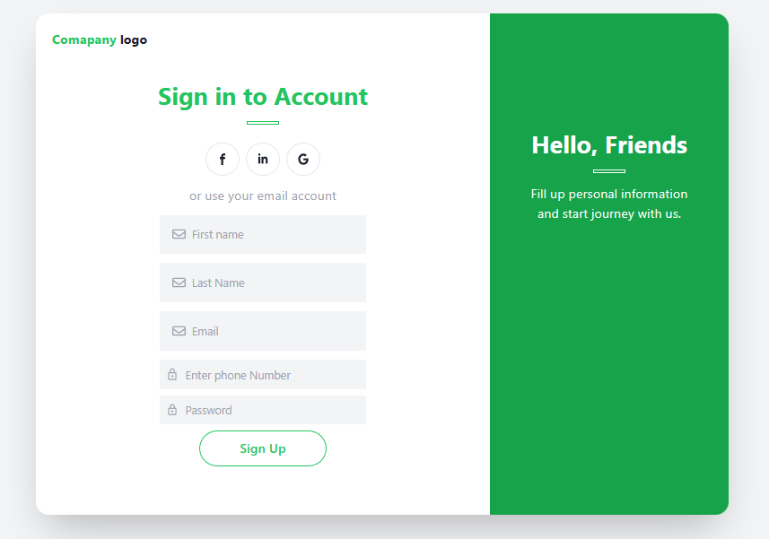
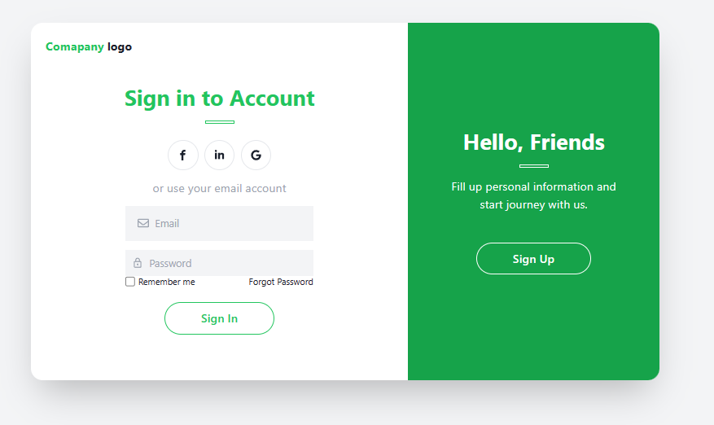
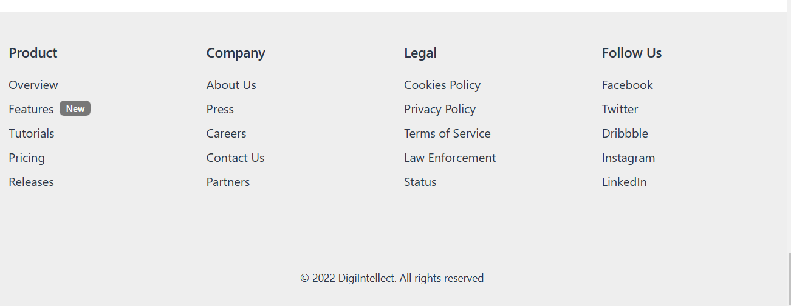

# DIGI PATHSHALA

## About

### It is a Educational website where user can learning and give some mock test to enhance his knowledge.

## Team Members

- [JYOTIRANJAN MOHANTY](https://github.com/jyotiranjan1997)
- [Amit Bhutani](https://github.com/amss-22)
- [Bharat Kumar](https://github.com/Bharathkumar1999)
- [Sanket Yadav](https://github.com/yadavsankt24)

## Features

- Signup
- Login ( user login and admin login )
- user profile
- Navbar
- Search functionality
- Footer
- Home Page
- Product Page
- Mock Test
- User update details 

## Tech-Stack and library

- HTML
- CSS
- NextJs
- JavaScript
- MongoDB
- ExpressJS
- ReactJS
- NodeJS
- Chakra-UI
- Tailwind 
- framer-motion
- Chat with admin
- react-router-dom
- React Redux

## Overview

- ### Navbar
  
- ### Signup or Register
  
- ### Login
  
- ### Admin Dashboard
  
- ### Home Page
  
- ### Product Page
  
- ### Cart Page
  
- ### Checkout Page
  
- ### Footer
  
